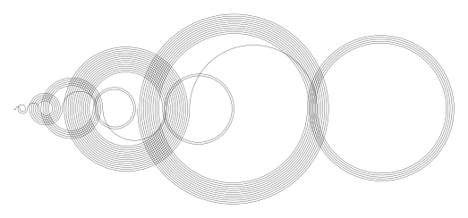
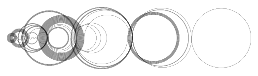

# Recamán's sequence image and animation generator

Inspired by [this Numberphile video](https://www.youtube.com/watch?v=FGC5TdIiT9U), this Python 3 script generates images and animations for [Recamán's sequence](https://oeis.org/A005132).

Requires `matplotlib` for image and animation generation and `tqdm`.

## Usage

```
usage: plot.py [-h] [--start M] [--format {png,svg}] [--dpi DPI]
               [--line-width WIDTH] [--anim] [--fps FPS] [--anim-dpi DPI]
               [--degree-skip SKIP]
               N

Plot the first N numbers of the Recamán sequence

positional arguments:
  N

optional arguments:
  -h, --help          show this help message and exit
  --start M           Start the sequence with M
  --format {png,svg}  Choose a format for the plot
  --dpi DPI           Set DPI for the plot
  --line-width WIDTH  Set line width of circles
  --anim              Animate plot
  --fps FPS           Set frames per second of animation
  --anim-dpi DPI      Set DPI for the animation
  --degree-skip SKIP  Set degrees to skip in circle animation
```

## Examples

Generate a `png` image of the first 100 numbers in the sequence
```
python plot.py 100
```


Generate the animation in `mp4` format (`ffmpeg` required) with each semicircle generated 10 degrees per frame
```
python plot.py 100 --anim --degree-skip 10
```
[](examples/recaman_100_start_0.mp4)

### Start argument
You can change the start number in the sequence using the `--start` argument. For example:
```
$ python recaman.py 200
[0, 1, 3, 6, 2, 7, 13, 20, 12, 21, 11, 22, 10, 23, 9, 24, 8, 25, 43, 62, 42, ...]
$ python plot.py 200
```


```
$ python recaman.py 200 --start 100
[100, 99, 97, 94, 90, 85, 79, 72, 64, 55, 45, 34, 22, 9, 23, 8, 24, 7, 25, 6, 26, 5, 27, 4, 28, 3, 29, 2, 30, 1, 31, 0, 32, ...]
$ python plot.py 200 --start 100
```


## License

[MIT License](LICENSE)